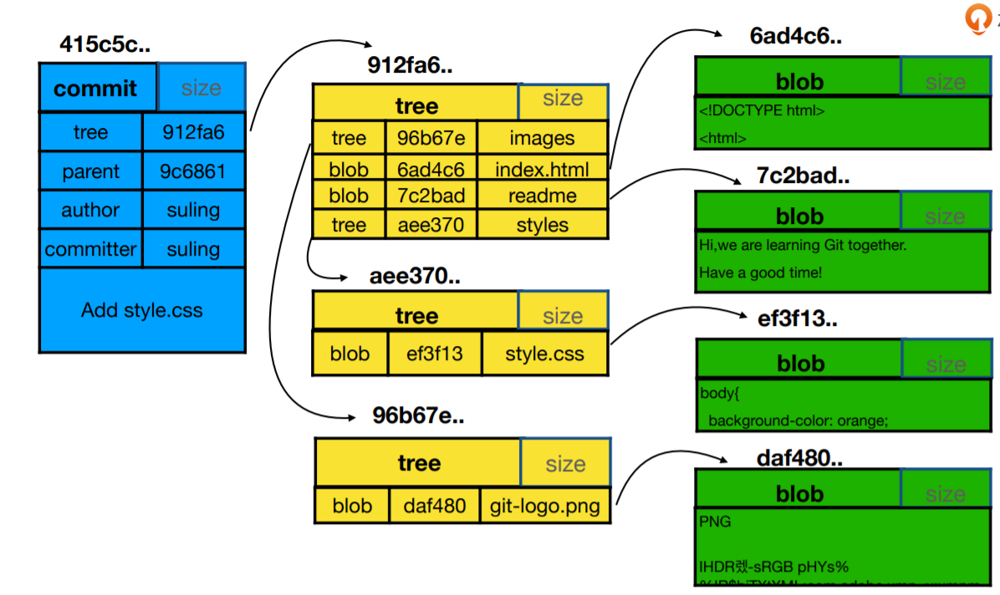
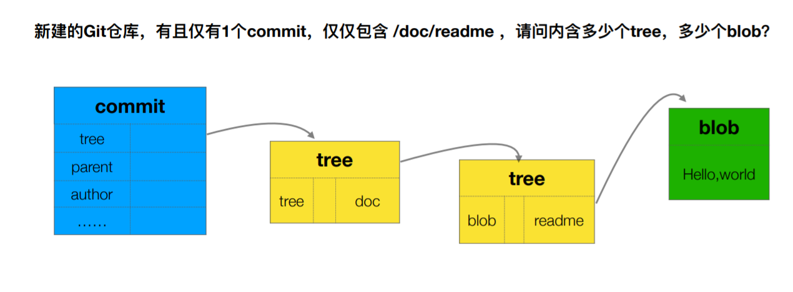
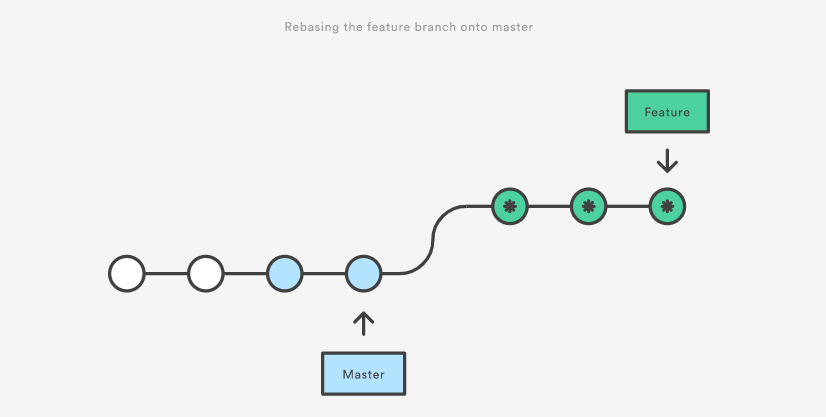

# 玩转Git三剑客

## 添加最小配置:

git config --local user.name 'logan'
git config --local user.email 'logan@163.com'

git config 参数区别:
--local ##只对某个仓库有效,切换到另外一个仓库失效
--global ##当前用户的所有仓库有效,工作当中最常用
--system ##系统的所有用户,几乎不用

查看配置:

git config --list --local  ##只能在仓库里面起作用, 普通路径git不管理
git config --list --global / --system

配置文件local的在.git/config里面；global的在个人home目录下的.gitconfig里面；system应该在git安装目录下

清除设置
$ git config --unset --local user.name

## 常用命令

git add . ：添加到暂存区,对当前路径及其子路径下的变更有效。而 add -A 是整个仓库。
git add -u:可以直接添加所有已经追踪的文件

1）git push origin master:master  前面的master是本地分支名称，：后面的master是远端分支的名称。
2）git push origin master，后面没带远端的master，那是因为git已经为本地的master分支和远端的分支建立了所谓的 upstream 的关联，它知道本地master对应远端的master分支。当然，git也允许我们修改本地分支的 upstream。可以看看 git branch --set-upstream 命令。

3）origin 是缺省的 remote url；


## 文件重命名

git mv files Files 

git config core.ignorecase true

## 通过git log查看版本历史

• git log --all 查看所有分支的历史
• git log --all --graph 查看图形化的 log 地址
• git log --oneline 查看单行的简洁历史。
• git log --oneline -n4 查看最近的四条简洁历史。
• git log --oneline --all -n4 --graph 查看所有分支最近 4 条单行的图形化历史。
• git help --web log 跳转到git log 的帮助文档网页

什么时候用-- 什么时候用-呢，似乎是单字母的参数是 '-'，非单字母的参数是'--'。


git commit -am'Add test' 工作区的东西直接创建到版本历史库当中

git checkout -b temp 444b2ecba0 创建分支

gitk 可以查看git log图行化节目

## .git目录中的内容

git cat-file 显示版本库对象的内容、类型及大小信息。
git cat-file -t b44dd71d62a5a8ed3 显示版本库对象的类型
git cat-file -p b44dd71d62a5a8ed3 显示版本库对象的内容

HEAD：（指向当前所在的分支），例如当前在 develop 分支，实际指向地址是 refs/heads/develop
config：存放本地仓库（local）相关的配置信息。
refs/heads:存放分支
refs/tags:存放tag，又叫里程牌 （当这次commit是具有里程碑意义的 比如项目1.0的时候 就可以打tag）
objects：存放对象 .git/objects/ 文件夹中的子文件夹都是以哈希值的前两位字符命名 每个object由40位字符组成，前两位字符用来当文件夹，后38位做文件。



## git底层的运行流程

当我们添加或者修改了文件并且add到Stage Area之后，首先会根据文件内容创建不同的blob，当进行提交之后马上创建一个tree组件把需要的blob组件添加进去，之后再封装到一个commit组件中完成本次提交。在将来进行reset的时候可以直接使用git reset --hard xxxxx可以恢复到某个特定的版本，在reset之后，git会根据这个commit组件的id快速的找到tree组件，然后根据tree找到blob组件，之后对仓库进行还原，整个过程都是以hash和二进制进行操作，所以git执行效率非常之高。

每次commit 操作 都会产生一个tree 这个tree 是包含当时整个项目中的所有文件夹及文件和本次新增的文件

**如果每一个commit都存一份自己的files，那多commit几下不是很快内存就用完了？这里git是怎么优化的呢？**

回复: commit里面涉及文件内容的那部分都存在blob中，内容相同的文件用的是相同的blob。举个例子，commit1有1000个文件，commit2在commit1上只修改了1个文件，那么，其中没发生变化的999个文件这俩个commit用的是相同的blob。存储就节约下来了，

git reset HEAD <filename> # 将修改从缓存区撤销
git checkout -- <filename> # 从版本历史中，取出来最新的该文件
\-----------------
这两个命令也可以合成一步进行操作，可以考虑尝试一下~
git checkout HEAD <filename>



## 分离头指针

git checkout a3f6f6b 

**那分离头指针在企业或日常使用中, 到底有哪些具体的适用地点呢?**

 如果临时想基于某个commit做变更，试试新方案是否可行，就可以采用分离头指针的方式。测试后发现新方案不成熟，直接reset回其他分支即可。省却了建、删分支的麻烦了。

git checkout -b master 新建分支
git branch fix_bug a3f6f6b 给新产生的分支命名

本地的子模块不知道怎么就分离了头指针，不仅commit了，还push到远程仓库了。现在把远程的仓库的head指针拉了回来。但是commit的那个东西还是在远程仓库中，不知道怎么删除，递归克隆的时候会报错，想问问这个怎么办

对子模块远程仓库的分支做push -f ，应该可以搞定的

****

git diff HEAD

HEAD^^ 等同于 HEAD~2 

"^"这个操作符代表父commit。
当一个commit有多个父commit时，可以通过在符号“^”后面跟上一个数字来表示第几个父commit。
比如，"A^" 等于 “A^1”(表示A这个commit的第1个父commit)。

连续的“^”符号依次沿着父commit进行定位，直到某个祖先commit。

~<n> 相当于连续n个符合“^”。


git branch -d branch_name:使用-d 在删除前Git会判断在该分支上开发的功能是否被merge的其它分支

git commit --amend 命令应该是代替（或这说修改）上一次提交，不只是修改message。
比如上一次提交时有几个文件没有add以及commit，可以重新进行add之后再commit --amend提交。

git rebase -i father_commit_id

## 比较文件的差异？

暂存区与HEAD比较：git diff --cached  git diff --staged
暂存区与工作区比较: git diff
暂存区恢复成HEAD : git reset HEAD --filename  
暂存区覆盖工作区修改：git checkout

git reset --hard hashcode

**将暂存区文件存起来**

git stash

git stash apply

git stash list 显示的最左一列就是stash的序号，如stash@{2} 和 stash@{1}，序号中数字大的代表的是较早的stash。我们pop的时候可以加具体的序号，不加序号的（缺省情况下）为 stash@{0}。

用法：git stash pop stash@{2}
      git stash pop = git stash pop stash@{0}

## GitIgnore

git管doc文件夹，不管doc文件，要怎么设置呢？

.gitignore如下配置

doc
!doc/*

## 将Git仓库备份到本地？

远程库:
​       git clone --bare file:///XXXX/.git remoteRepoName.git   bare不包含工作区，在代码仓库的服务端很有用

本地仓库:

​         跟远程库建立关联: git remote add remote file:///XXXX/remoteRepoName.git   remote是远程分支的别名

​         推送分支变动到远程 git push /  git push --set-upstream remote master

有备份，应该也有还原吧。
1）找个目录执行 clone 。或
2）用init建个git仓库，然后从备份数据库添加remote，再push到新建仓库；或者
3）用init建个git仓库，然后在新仓库添加remote，再把备份数据库fetch/pull到新仓库。

## 把本地仓库同步到GitHub

git remote -v 查看远程版本库信息
git remote add githup <url> 添加githup远程版本库
git fetch githup 拉取远程版本库
git merge --allow-unrelated-histories githup/master 合并githup上的master分支（两分支不是父子关系，所以合并需要添加 --allow-unrelated-histories）
git push githup master推送同步到githup仓库

本地分支往远端分支做push，如果远端分支不是本地分支的祖先，那它俩就不是 fast forward 了。反之，它俩就是fast forward的关系。


## 不同人修改了同文件的同一区域如何处理？

merge rebase到底有什么区别?

 拿两个分支简单一点来说，

git的merge命令，不会改变两个分支已有的版本历史，只会把两个分支合并后创建出一个新的commit出来。

git的rebase命令，假设当前在A分支，要基于B分支做rebase，那么，先找到A和B最近的公共祖先C1，从C1到A之间的所有commit，都基于B重新生成新的commit。看来，rebase通常会修改某个分支的历史。



## Git集成使用禁忌

集成分支禁止rebase，多人协作是一般都会有 各个仓库的merge，怎么保证集成分支的commit是线性的呢？

作者回复: 如果线性对你们团队很重要的话，办法肯定是有的。比如master为集成分支，且要求版本历史为线性，假设在GitHub平台上，首先为master分支设置Branch protection rule（不允许直接push），勾选“Require pull request reviews before merging。

其次，Merge Button选择“Allow squash merging”或者“Allow rebase merging”，不要选“Allow merge commits”

## Github

advance search project:  spring boot in:readme starts:>1000 

- Allow merge commits

    Add all commits from the head branch to the base branch with a merge commit.

- Allow squash merging

    Combine all commits from the head branch into a single commit in the base branch.

- Allow rebase merging

    Add all commits from the head branch onto the base branch individually.

## FQA

1. 本地有个项目代码写了一段时间了，但还没有用 git 管理起来，现在想用git在本地帮着记录变更的版本。

    ```
    cd existing_folder （本地进入到项目文件夹内）
    git init （执行 init 命令，会创建出 .git 目录）
    git add . （把项目文件加入到 git 的暂存区）
    git commit -m "Initial commit" （创建第一个 git 的commit ）
    ```

2. 之前本地生成了一个 git 的仓库，开发了一段时间，想把这个git仓库提交到公司git服务器新建的project中。

    ```
    cd existing_repo
    git remote add origin git@your_git_server:your_group/your_project.git
    git push -u origin --all
    git push -u origin --tags
    ```

3. 怎么把代码回退到暂存区里面的版本

```
1) 如果要把工作区的某个 file 替换为暂存区，则 git checkout -- file

2) 如果要把工作区变更的所有文件都恢复成和暂存区的一样，则 git checkout *
```

   4.如果修改git的日期格式，如改为Date： YYYY-MM-DD 24hh:mm:ss如何配置？

```
git log --date=format:%Y-%m-%d\ %H:%M:%S 
git log --date=iso
git log --date=short
```

5.有一个甲方和乙方共研项目。2个gitlab，其中甲方有内外网物理隔离，也就是说2个gitlab没法联网。

回复: 我们的做法是：为对外合作项目单独搭建了一个gitlab，公司内部员工用内网域名，合作方用外网域名，并且为外网IP设置了白名单，只有授权的IP才能访问公司的gitlab

 git clone git@github.com:git2019/git_learning.git 既然已经把远程仓库所有内容都克隆到本地了，为什么还需要
git checkout -b feature/add_git_commands      origin/feature/add_git_command

 命令基于远程分支在本地建立分支，不是从远程clone下来了嘛，为什么还要新建，难道clone命令不能克隆分支嘛

回复: 我们在本地无法直接在clone下来的远程分支上做变更的，只能基于远程分支建本地分支后，才能创建commit

6.如果发现之前提交的commit不想要了，想恢复成之前的样子，是不是就不得不用git push -f命令了呢？

回复: 自己独自使用的分支，可以采用push -f 的方式。

团队集成分支，通常做法不是去掉不想要的commit，而是把不想要的commit的内容采用revert的方式生成新的commit，以此去掉不想要的变更。然后push到远端