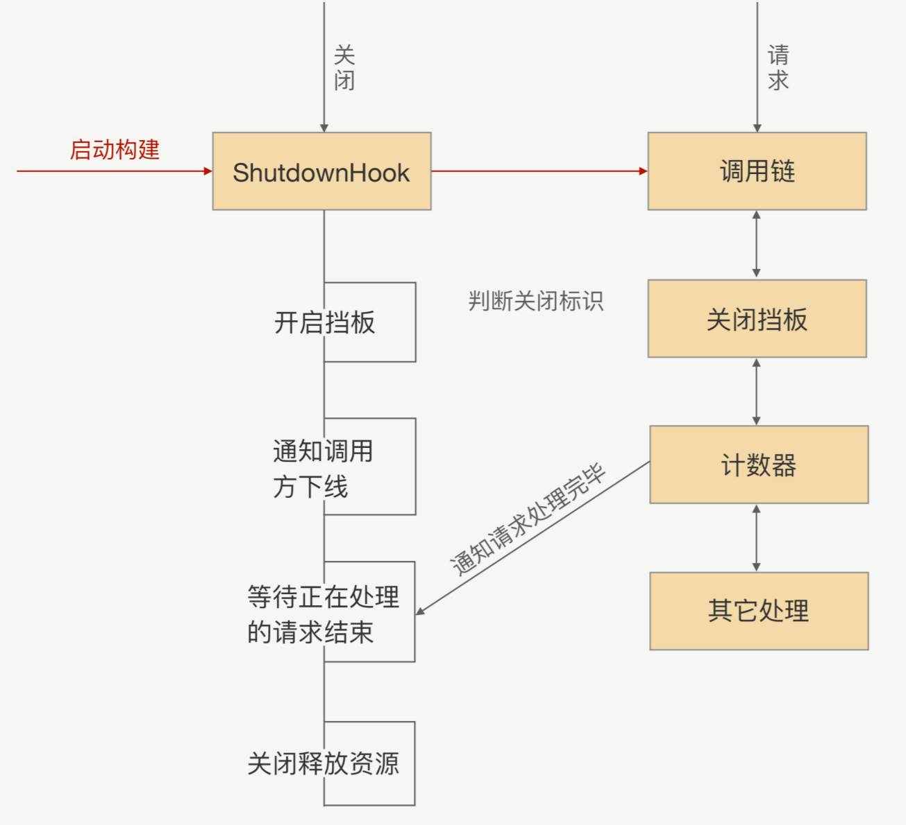

# 07 | 架构设计：设计一个灵活的RPC框架

 RPC 就是把拦截到的方法参数，转成可以在网络中传输的二进制， 并保证在服务提供方能正确地还原出语义，最终实现像调用本地一样地调用远程的目 的

RPC 架构

RPC 里面都有哪些功能模块

传输模块:  TCP 协议。为了屏蔽网络 传输的复杂性， 封装一个单独的数据传输模块用来收发二进制数据 

协议模块: 序列化过程,“断句”符号来分隔出不同的请求,压缩功能

 Bootstrap 模块 要让这两个模块同时工作的话，我们需要手写一些黏合的 代码，但这些代码对我们使用 RPC 的研发人员来说是没有意义的  把 RPC 接口定义成 一个 Spring Bean，并且这个 Bean 也会统一被 Spring Bean Factory 管理，可以在项目 中通过 Spring 依赖注入到方式引用 

 集群能力，就是针对同一个接口有着多个服务提供者,服务发现

连接管理器去维护 TCP 连接的状态

# 08 | 服务发现：到底是要CP还是AP？

服务注册：在服务提供方启动的时候，将对外暴露的接口注册到注册中心之中，注册中 心将这个服务节点的 IP 和接口保存下来

服务订阅：在服务调用方启动的时候，去注册中心查找并订阅服务提供方的 IP，然后缓 存到本地，并用于后续的远程调用。

提升性能和减少 DNS 服务的压力，DNS 采取了多级缓存机制，一般配置的缓存时间较长， 所以说服务调用者不能及时感知到服务节点的变化

并不是很合适，原因有 以下几点：

 搭建负载均衡设备或 TCP/IP 四层代理，需求额外成本； 

请求流量都经过负载均衡设备，多经过一次网络传输，会额外浪费些性能；

 负载均衡添加节点和摘除节点，一般都要手动添加，当大批量扩容和下线时，会有大量 的人工操作和生效延迟； 

我们在服务治理的时候，需要更灵活的负载均衡策略，目前的负载均衡设备的算法还满 足不了灵活的需求。

### 基于 ZooKeeper 的服务发现

成接口跟服 务提供者 IP 之间的映射  ZooKeeper、etcd 

### 基于消息总线的最终一致性的注册中心

注册数据可以全量缓存在每个注册 中心内存中，通过消息总线来同步数据。当有一个注册中心节点接收到服务节点注册时，会 产生一个消息推送给消息总线，再通过消息总线通知给其它注册中心节点更新数据并进行服 务下发，从而达到注册中心间数据最终一致性

## 09 | 健康检测：这个节点都挂了，为啥还要疯狂发请求？

###  路由策略：怎么让请求按照设定的规则发到不同的节点上

如何实现路由策略？

先让 一小部分调用方请求过来进行逻辑验证，待没问题后再接入其他调用方，从而实现流量隔离 的效果

注册中心只会把刚上线的服务 IP 地址推送到选择 指定的调用方，而其他调用方是不能通过服务发现拿到这个 IP 地址的

通过服务发现的方式来隔离调用方请求，从逻辑上来看确实可行，但注册中心在 RPC 里面 的定位是用来存储数据并保证数据一致性的。如果把这种复杂的计算逻辑放到注册中心里 面，当集群节点变多之后，就会导致注册中心压力很大

以在选择节点前加上“筛选逻辑”，把符合我们要求的节点筛选出来。那这个筛 选的规则是什么呢？就是我们前面说的灰度过程中要验证的规则

举个具体例子你可能就明白了，比如我们要求新上线的节点只允许某个 IP 可以调用，那我 们的注册中心会把这条规则下发到服务调用方。在调用方收到规则后，在选择具体要发请求 的节点前，会先通过筛选规则过滤节点集合，按照这个例子的逻辑，最后会过滤出一个节 点，这个节点就是我们刚才新上线的节点。

****

在日常工作中，我们几乎每天都在做线上变更，每次变更都有可能带来一次事故，为了降低 事故发生的概率，我们不光要从流程上优化操作步骤，还要使我们的基础设施能支持更低的 试错成本。 灰度发布功能作为 RPC 路由功能的一个典型应用场景，我们可以通过路由功能完成像定点 调用、黑白名单等一些高级服务治理功能。在 RPC 里面，不管是哪种路由策略，其核心思 想都是一样的，就是让请求按照我们设定的规则发送到目标节点上，从而实现流量隔离的效 果

# 11 | 负载均衡：节点负载差距这么大，为什么收到的流量还一样？

 RPC 中如何实现负载均衡

RPC 框架有没有什么智能负载的机制？能否及时地自动控制服务节点接收到的访 问量？

当我们的一个服务节点无法支撑现有的访问量时，我们会部 署多个节点，组成一个集群，然后通过负载均衡，将请求分发给这个集群下的每个服务节点，从而达到多个服务节点共同分担请求压力的目的。

负载均衡主要分为**软负载和硬负载**，软负载就是在一台或多台服务器上安装负载均衡的软 件，如 LVS、Nginx 等，硬负载就是通过硬件设备来实现的负载均衡，如 F5 服务器等。负载均衡的算法主要有随机法、轮询法、最小连接法等

RPC 实现的负载均衡所采用的策略与传统的 Web 服务实现负载均衡所采用策略的不同之处

RPC 的负载均衡完全由 RPC 框架自身实现，RPC 的服务调用者会与“注册中心”下发的所 有服务节点建立长连接，在每次发起 RPC 调用时，服务调用者都会通过配置的负载均衡插 件，自主选择一个服务节点，发起 RPC 调用请求

如何设计自适应的负载均衡？

如何判定一个服务节点的处理能力呢

采用一种打分的策略，服务调用者收集与之建立长连接的每个服务节点的指标 数据，如服务节点的负载指标、CPU 核数、内存大小、请求处理的耗时指标（如请求平均 耗时、TP99、TP999）、服务节点的状态指标（如正常、亚健康）

服务调用者给每个服务节点都打完分之后，会发送请求，那这时候我们又该如何根据分数去 控制给每个服务节点发送多少流量呢？ 我们可以配合随机权重的负载均衡策略去控制，

  RPC 框架的负载均衡，它与 Web 服务的负载均衡的不同之处在于： RPC 框架并不是依赖一个负载均衡设备或者负载均衡服务器来实现负载均衡的，而是由 RPC 框架本身实现的，服务调用者可以自主选择服务节点，发起服务调用。

以 Dubbo 为例，常用的负载均衡方法有：
1.基于权重随机算法
2.基于最少活跃调用数算法
3.基于 hash 一致性
4.基于加权轮询算法

hash 一致性算法，适用于服务有状态的的场景

轮询算法与随机算法, 适用于集群中各个节点提供服务能力等同且无状态的场景

# 12 | 异常重试：在约定时间内安全可靠地重试

RPC 框架中的异常重试机制。

RPC 框架的重试机制就是调用端发现请求失败时捕获异常，之后触发重试 , 只有符合重试条件的异常才能 触发重试，比如网络超时异常、网络连接异常等等

**在使用异常重试时需要注意哪些问题呢？**

在使用 RPC 框架的时候，我们要确保被调用的服务的业务逻辑是 幂等的

连续的异常重试可能会出现一种不可靠的情况，那就是连续的异常重试并且每 次处理的请求时间比较长，最终会导致请求处理的时间过长，超出用户设置的超时时间

在每次重试后都重置一下请求的超时时间

考虑了业务逻辑必须是幂等的、超时时间需要重置以及去掉 有问题的服务节点后，这样的异常重试机制，还有没有可优化的地方呢？

RPC 框架是不会知道哪些业务异常能够去进行异常重试的，我们可以加个重试异常的白名 单，用户可以将允许重试的异常加入到这个白名单中

# 13 | 优雅关闭：如何避免服务停机带来的业务损失？

以更方便、更快速地迭代业务

会经常更新应用系统，时不时还老要重启服务器

RPC 怎么做到让调用方系统不出问题呢？

那服务提供方自己来通知行不行？因 为在 RPC 里面调用方跟服务提供方之间是长连接，我们可以在提供方应用内存里面维护一 份调用方连接集合，当服务要关闭的时候，挨个去通知调用方去下线这台机器。这样整个调 用链路就变短了，对于每个调用方来说就一次 RPC，可以确保调用的成功率很高。

大部分 场景下，这么做确实没有问题，我们之前也是这么实现的，但是我们发现线上还是会偶尔会 出现，因为服务提供方上线而导致调用失败的问题

优雅关闭 知道了根本原因，问题就很好解决了。因为服务提供方已经开始进入关闭流程，那么很多对 象就可能已经被销毁了，关闭后再收到的请求按照正常业务请求来处理，肯定是没法保证能 处理的。所以我们可以在关闭的时候，设置一个请求“挡板”，挡板的作用就是告诉调用 方，我已经开始进入关闭流程了，我不能再处理你这个请求了

# 14 | 优雅启动：如何避免流量打到没有启动完成的节点？

 RPC 里面的一个实用功能——启动预热

简单来说，就是让刚启动的服务提供方应用不承担全部的流量，而是让它被调用的次数随着 时间的移动慢慢增加，最终让流量缓和地增加到跟已经运行一段时间后的水平一样

怎么实现这个功能呢?

调用方应用通过服务发现能够获取到服务提供方的 IP 地址，然后 每次发送请求前，都需要通过负载均衡算法从连接池中选择一个可用连接

首先对于调用方来说，我们要知道服务提供方启动的时间，这个怎么获取呢？我这里给出两种方法，一种是服务提供方在启动的时候，把自己启动的时间告诉注册中心；另外一种就是 注册中心收到的服务提供方的请求注册时间。

最终的结果就是，调用方通过服务发现，除了可以拿到 IP 列表， 还可以拿到对应的启动时间。我们需要把这个时间作用在负载均衡上，基于权重的负载均衡，但是这个权重是由服务提供方设置的，属于一个固定状 态。现在我们要让这个权重变成动态的，并且是随着时间的推移慢慢增加到服务提供方设定 的固定值

