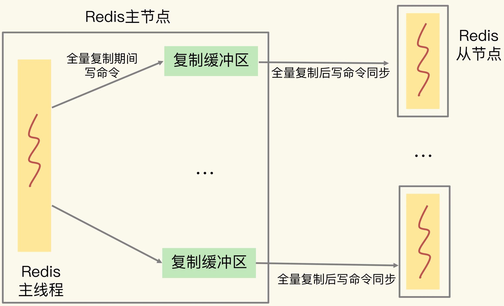
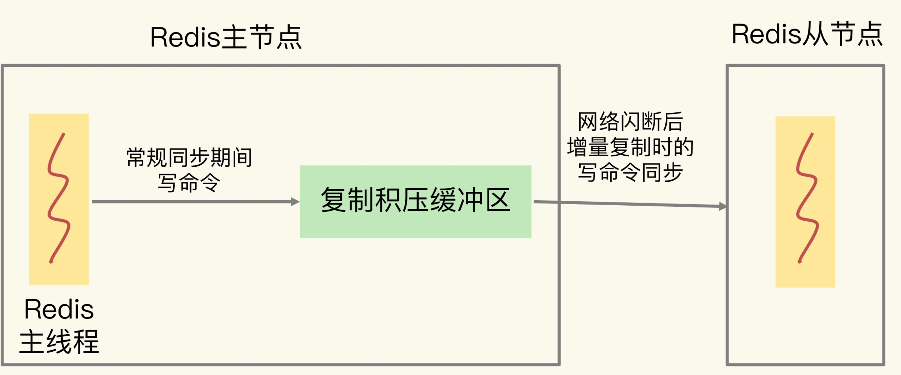
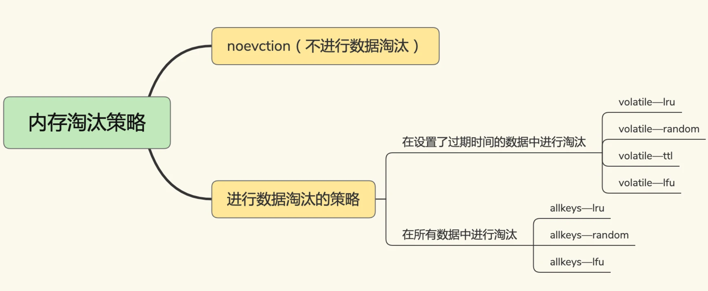
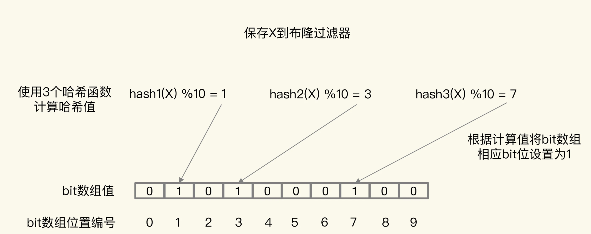
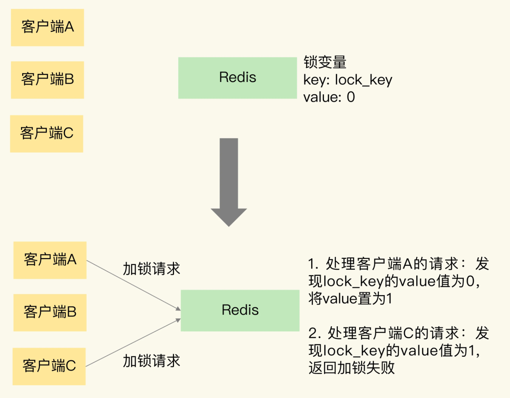
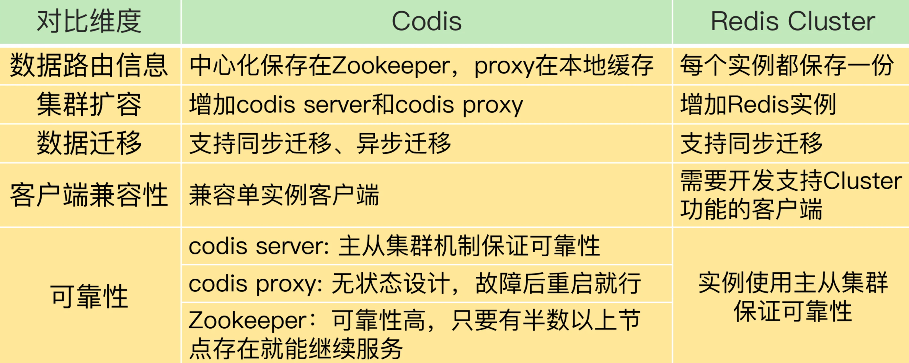
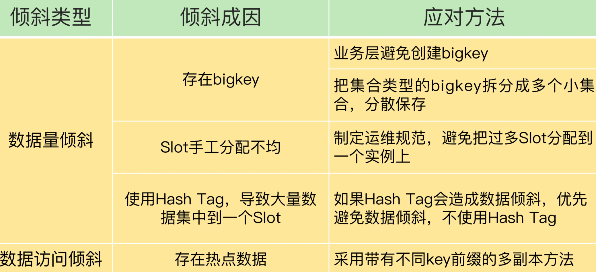

# redis 实战

**消息队列在存取消息时，必须要满足三个需求，分别是消息保序、处理重复的消息和保证消息可靠性。**

消费者仍然需要按照生产者发送消息的顺序来处理消息

消费者从消息队列读取消息时，有时会因为网络堵塞而出现消息重传的情况。

消费者在处理消息的时候，还可能出现因为故障或宕机导致消息没有处理完成的情况。此时，消息队列需要能提供消息可靠性的保证，

Redis提供了BRPOP命令。**BRPOP命令也称为阻塞式读取，客户端在没有读到队列数据时，自动阻塞，直到有新的数据写入队列，再开始读取新数据**

一方面，消息队列要能给每一个消息提供全局唯一的ID号；另一方面，消费者程序要把已经处理过的消息的ID号记录下来

幂等性就是指，对于同一条消息，消费者收到一次的处理结果和收到多次的处理结果是一致的


**生产者消息发送很快，而消费者处理消息的速度比较慢，这就导致List中的消息越积越多，给Redis的内存带来很大压力**。

这个时候，我们希望启动多个消费者程序组成一个消费组，一起分担处理List中的消息。但是，List类型并不支持消费组的实现。那么，还有没有更合适的解决方案呢？这就要说到Redis从5.0版本开始提供的Streams数据类型了。


# CPU结构也会影响Redis的性能

物理核的私有缓存。它其实是指缓存空间只能被当前的这个物理核使用

L1和L2缓存的大小KB级别

L3缓存能够 存储几MB到几十MB

现在主流的CPU处理器中，每个物理核通常都会运行两个超线程，也叫作逻辑核。同一个物理核的逻辑核会共享使用L1、L2缓存


在主流的服务器上，一个CPU处理器会有10到20多个物理核


在多CPU架构下，一个应用程序访问所在Socket的本地内存和访问远端内存的延迟并不一致，所以，我们也把这个架构称为非统一内存访问架构（Non-Uniform Memory Access，NUMA架构）

context switch是指线程的上下文切换，这里的上下文就是线程的运行时信息。在CPU多核的环境中，一个线程先在一个CPU核上运行，之后又切换到另一个CPU核上运行，这时就会发生context switch。

## Redis中缓冲区

Redis是典型的client-server架构

客户端和服务器端、主从集群间的缓冲区溢出问题，以及应对方案

#### 输入缓冲区溢出

- 写入了bigkey，比如一下子写入了多个百万级别的集合类型数据；
- 服务器端处理请求的速度过慢


```
CLIENT LIST 
id=5 addr=127.0.0.1:50487 fd=9 name= age=4 idle=0 flags=N db=0 sub=0 psub=0 multi=-1 
qbuf=26 qbuf-free=32742 obl=0 oll=0 omem=0 events=r cmd=client
```

Redis服务器端不止服务一个客户端，当多个客户端连接占用的内存总量，超过了Redis的maxmemory配置项时（例如4GB），就会触发Redis进行数据淘汰。一旦数据被淘汰出Redis，再要访问这部分数据，就需要去后端数据库读取

避免输入缓冲区溢出

**把缓冲区调大，二是从数据命令的发送和处理速度入手**

上限阈值 为1GB

#### 输出缓冲区

**那什么情况下会发生输出缓冲区溢出呢？** 我为你总结了三种：

- 服务器端返回bigkey的大量结果；
- 执行了MONITOR命令；
- 缓冲区大小设置得不合理。

```
MONITOR
OK 
1600617456.437129 [0 127.0.0.1:50487] "COMMAND" 
1600617477.289667 [0 127.0.0.1:50487] "info" "memory"
```

```
client-output-buffer-limit normal 0 0 0
client-output-buffer-limit pubsub 8mb 2mb 60
```

普通客户端  订阅客户端

## 主从集群中的缓冲区



```
config set client-output-buffer-limit slave 512mb 128mb 60
```

### 复制积压缓冲区



缓冲区溢出，无非就是三个原因：命令数据发送过快过大；命令数据处理较慢；缓冲区空间过小

缓冲区来降低两端速度不匹配的影响

主从同步延迟，数据积压在主库上的从库输出缓冲区中，这个缓冲区内存占用变大，不会超过maxmemory导致淘汰数据。只有普通客户端和订阅客户端的输出缓冲区内存增长，超过maxmemory时，才会淘汰数据

# 旁路缓存：Redis是如何工作的

工作原理、替换策略、异常处理和扩展机制。具体来说，我们需要解决四个关键问题：

- Redis缓存具体是怎么工作的？
- Redis缓存如果满了，该怎么办？
- 为什么会有缓存一致性、缓存穿透、缓存雪崩、缓存击穿等异常，该如何应对？
- Redis的内存毕竟有限，如果用快速的固态硬盘来保存数据，可以增加缓存的数据量，那么，Redis缓存可以使用快速固态硬盘吗？


- **缓存命中**：Redis中有相应数据，就直接读取Redis，性能非常快。
- **缓存缺失**：Redis中没有保存相应数据，就从后端数据库中读取数据，性能就会变慢。而且，一旦发生缓存缺失，为了让后续请求能从缓存中读取到数据，我们需要把缺失的数据写入Redis，这个过程叫作缓存更新。缓存更新操作会涉及到保证缓存和数据库之间的数据一致性问题


Redis称为旁路缓存，也就是说，读取缓存、读取数据库和更新缓存的操作都需要在应用程序中来完成

具体来说，我们需要在应用程序中增加三方面的代码：

- 当应用程序需要读取数据时，我们需要在代码中显式调用Redis的GET操作接口，进行查询；
- 如果缓存缺失了，应用程序需要再和数据库连接，从数据库中读取数据；
- 当缓存中的数据需要更新时，我们也需要在应用程序中显式地调用SET操作接口，把更新的数据写入缓存

Redis缓存的两种类型：只读缓存和读写缓存


同步直写和异步写回两种策略。同步直写策略优先保证数据可靠性，而异步写回策略优先提供快速响应


Redis做缓存时，还有两种模式，分别是只读缓存和读写缓存。其中，读写缓存还提供了同步直写和异步写回这两种模式

# 替换策略：缓存满了怎么办

**缓存数据的淘汰机制**。

数据淘汰机制包括两步：第一，根据一定的策略，筛选出对应用访问来说“不重要”的数据；

第二，将这些数据从缓存中删除，为新来的数据腾出空间，



使用EXPIRE命令,无论是这些键值对的过期时间是快到了，还是Redis的内存使用量达到了maxmemory阈值

LRU会把所有的数据组织成一个链表，链表的头和尾分别表示MRU端和LRU端，分别代表最近最常使用的数据和最近最不常用的数据


当一个系统引入缓存时，需要面临最大的问题就是，如何保证缓存和后端数据库的一致性问题，最常见的3个解决方案分别是Cache Aside、Read/Write Throught和Write Back缓存更新策略。

1、Cache Aside策略：就是文章所讲的只读缓存模式。读操作命中缓存直接返回，否则从后端数据库加载到缓存再返回。写操作直接更新数据库，然后删除缓存。这种策略的优点是一切以后端数据库为准，可以保证缓存和数据库的一致性。缺点是写操作会让缓存失效，再次读取时需要从数据库中加载。这种策略是我们在开发软件时最常用的，在使用Memcached或Redis时一般都采用这种方案。

2、Read/Write Throught策略：应用层读写只需要操作缓存，不需要关心后端数据库。应用层在操作缓存时，缓存层会自动从数据库中加载或写回到数据库中，这种策略的优点是，对于应用层的使用非常友好，只需要操作缓存即可，缺点是需要缓存层支持和后端数据库的联动。

3、Write Back策略：类似于文章所讲的读写缓存模式+异步写回策略。写操作只写缓存，比较简单。而读操作如果命中缓存则直接返回，否则需要从数据库中加载到缓存中，在加载之前，如果缓存已满，则先把需要淘汰的缓存数据写回到后端数据库中，再把对应的数据放入到缓存中。这种策略的优点是，写操作飞快（只写缓存），缺点是如果数据还未来得及写入后端数据库，系统发生异常会导致缓存和数据库的不一致。这种策略经常使用在操作系统Page Cache中，或者应对大量写操作的数据库引擎中。

# 缓存异常：缓存和数据库的数据不一致问题


数据的一致性”具体是啥意思。其实，这里的“一致性”包含了两种情况：

- 缓存中有数据，那么，缓存的数据值需要和数据库中的值相同；

- 缓存中本身没有数据，那么，数据库中的值必须是最新值。

##### 读写缓存

读写缓存来说，如果要对数据进行增删改，就需要在缓存中进行，同时还要根据采取的写回策略，决定是否同步写回到数据库中。

- 同步直写策略：写缓存时，也同步写数据库，缓存和数据库中的数据一致；

- 异步写回策略：写缓存时不同步写数据库，等到数据从缓存中淘汰时，再写回数据库。使用这种策略时，如果数据还没有写回数据库，缓存就发生了故障，那么，此时，数据库就没有最新的数据了

    

##### 只读缓存


在大多数业务场景下，我们会把Redis作为只读缓存使用。针对只读缓存来说，我们既可以先删除缓存值再更新数据库，也可以先更新数据库再删除缓存。我的建议是，优先使用先更新数据库再删除缓存的方法，原因主要有两个：

1. 先删除缓存值再更新数据库，有可能导致请求因缓存缺失而访问数据库，给数据库带来压力；
2. 如果业务应用中读取数据库和写缓存的时间不好估算，那么，延迟双删中的等待时间就不好设置。


#### 缓存雪崩 cache avalanche

缓存雪崩 指大量的应用请求无法在Redis缓存中进行处理， 应用将大量请求发送到数据库层

一般是由两个原因导致的 

1.缓存中有大量数据同时过期，导致大量请求无法得到处理


两种解决方案 

给这些数据的过期时间增加一个较小的随机数

服务降级

所谓的服务降级，是指发生缓存雪崩时，针对不同的数据采取不同的处理方式。

- 当业务应用访问的是非核心数据（例如电商商品属性）时，暂时停止从缓存中查询这些数据，而是直接返回预定义信息、空值或是错误信息；
- 当业务应用访问的是核心数据（例如电商商品库存）时，仍然允许查询缓存，如果缓存缺失，也可以继续通过数据库读取。


一般来说，一个Redis实例可以支持数万级别的请求处理吞吐量，而单个数据库可能只能支持数千级别的请求处理吞吐量


2.Redis缓存实例发生故障宕机了，无法处理请求

**第一个建议，是在业务系统中实现服务熔断或请求限流机制**


### 缓存击穿 cache breakdown

缓存击穿是指，针对某个访问非常频繁的热点数据的请求，无法在缓存中进行处理 访问该数据的大量请求，一下子都发送到了后端数据库


解决方法也比较直接，对于访问特别频繁的热点数据，我们就不设置过期时间

### 缓存穿透 cache penetration 

缓存穿透是指要访问的数据既不在Redis缓存中，也不在数据库中，导致请求在访问缓存时，发生缓存缺失，再去访问数据库时，发现数据库中也没有要访问的数据。此时，应用也无法从数据库中读取数据再写入缓存，来服务后续请求，这样一来，缓存也就成了“摆设”，如果应用持续有大量请求访问数据，就会同时给缓存和数据库带来巨大压力


缓存穿透会发生在什么时候呢？一般来说，有两种情况。

- 业务层误操作：缓存中的数据和数据库中的数据被误删除了，所以缓存和数据库中都没有数据；

- 恶意攻击：专门访问数据库中没有的数据。

    

**第一种方案是，缓存空值或缺省值。**

**第二种方案是，使用布隆过滤器快速判断数据是否存在，避免从数据库中查询数据是否存在，减轻数据库压力。**

在请求入口的**前端进行请求检测**，对业务系统接收到的请求进行合法性检测

布隆过滤器

一个初值都为0的bit数组和N个哈希函数组成

当我们想标记某个数据存在时（例如，数据已被写入数据库），布隆过滤器会通过三个操作完成标记：

- 首先，使用N个哈希函数，分别计算这个数据的哈希值，得到N个哈希值。
- 然后，我们把这N个哈希值对bit数组的长度取模，得到每个哈希值在数组中的对应位置。
- 最后，我们把对应位置的bit位设置为1，这就完成了在布隆过滤器中标记数据的操作。




## 缓存污染

在一些场景下，有些数据被访问的次数非常少，甚至只会被访问一次。当这些数据服务完访问请求后，如果还继续留存在缓存中的话，就只会白白占用缓存空间。这种情况，就是缓存污染。

volatile-ttl针对的是设置了过期时间的数据，把这些数据中剩余存活时间最短的筛选出来并淘汰掉。

除了在明确知道数据被再次访问的情况下，volatile-ttl可以有效避免缓存污染。在其他情况下，volatile-random、allkeys-random、volatile-ttl这三种策略并不能应对缓存污染问题。

Redis中的LRU策略，会在每个数据对应的RedisObject结构体中设置一个lru字段，用来记录数据的访问时间戳。在进行数据淘汰时，LRU策略会在候选数据集中淘汰掉lru字段值最小的数据（也就是访问时间最久的数据）

也正是**因为只看数据的访问时间，使用LRU策略在处理扫描式单次查询操作时，无法解决缓存污染**。所谓的扫描式单次查询操作，就是指应用对大量的数据进行一次全体读取，每个数据都会被读取，而且只会被读取一次。此时，因为这些被查询的数据刚刚被访问过，所以lru字段值都很大


LFU策略中会从两个维度来筛选并淘汰数据：一是，数据访问的时效性（访问时间离当前时间的远近）；二是，数据的被访问次数

## LFU缓存策略的优化

LFU缓存策略是在LRU策略基础上，为每个数据增加了一个计数器，来统计这个数据的访问次数。

当使用LFU策略筛选淘汰数据时，首先会根据数据的访问次数进行筛选，把访问次数最低的数据淘汰出缓存。

如果两个数据的访问次数相同，LFU策略再比较这两个数据的访问时效性，把距离上一次访问时间更久的数据淘汰出缓存

为了避免操作链表的开销，Redis在实现LRU策略时使用了两个近似方法：

- Redis是用RedisObject结构来保存数据的，RedisObject结构中设置了一个lru字段，用来记录数据的访问时间戳；
- Redis并没有为所有的数据维护一个全局的链表，而是通过随机采样方式，选取一定数量（例如10个）的数据放入候选集合，后续在候选集合中根据lru字段值的大小进行筛选。

在此基础上，**Redis在实现LFU策略的时候，只是把原来24bit大小的lru字段，又进一步拆分成了两部分**。

1. ldt值：lru字段的前16bit，表示数据的访问时间戳；
2. counter值：lru字段的后8bit，表示数据的访问次数。

**在实现LFU策略时，Redis并没有采用数据每被访问一次，就给对应的counter值加1的计数规则，而是采用了一个更优化的计数规则**。

简单来说，LFU策略实现的计数规则是：每当数据被访问一次时，首先，用计数器当前的值乘以配置项lfu_log_factor再加1，再取其倒数，得到一个p值；然后，把这个p值和一个取值范围在（0，1）间的随机数r值比大小，只有p值大于r值时，计数器才加1。

```
double r = (double)rand()/RAND_MAX; 
... 
double p = 1.0/(baseval*server.lfu_log_factor+1); 
if (r < p) counter++;   
```


counter值的衰减机制

在实际业务应用中，LRU和LFU两个策略都有应用。LRU和LFU两个策略关注的数据访问特征各有侧重，LRU策略更加关注数据的时效性，而LFU策略更加关注数据的访问频次。通常情况下，实际应用的负载具有较好的时间局部性，所以LRU策略的应用会更加广泛。但是，在扫描式查询的应用场景中，LFU策略就可以很好地应对缓存污染问题了，建议你优先使用。

此外，如果业务应用中有短时高频访问的数据，除了LFU策略本身会对数据的访问次数进行自动衰减以外，我再给你个小建议：你可以优先使用volatile-lfu策略，并根据这些数据的访问时限设置它们的过期时间，以免它们留存在缓存中造成污染

# 如何使用Redis实现分布式锁？

锁是保存在一个共享存储系统中的，可以被多个客户端共享访问和获取


在基于单个Redis实例实现分布式锁时，对于加锁操作，我们需要满足三个条件。

1. 加锁包括了读取锁变量、检查锁变量值和设置锁变量值三个操作，但需要以原子操作的方式完成，所以，我们使用SET命令带上NX选项来实现加锁；
2. 锁变量需要设置过期时间，以免客户端拿到锁后发生异常，导致锁一直无法释放，所以，我们在SET命令执行时加上EX/PX选项，设置其过期时间；
3. 锁变量的值需要能区分来自不同客户端的加锁操作，以免在释放锁时，出现误释放操作，所以，我们使用SET命令设置锁变量值时，每个客户端设置的值是一个唯一值，用于标识客户端。

和加锁类似，释放锁也包含了读取锁变量值、判断锁变量值和删除锁变量三个操作，不过，我们无法使用单个命令来实现，所以，我们可以采用Lua脚本执行释放锁操作，通过Redis原子性地执行Lua脚本，来保证释放锁操作的原子性。

不过，基于单个Redis实例实现分布式锁时，会面临实例异常或崩溃的情况，这会导致实例无法提供锁操作，正因为此，Redis也提供了Redlock算法，用来实现基于多个实例的分布式锁。这样一来，锁变量由多个实例维护，即使有实例发生了故障，锁变量仍然是存在的，客户端还是可以完成锁操作。Redlock算法是实现高可靠分布式锁的一种有效解决方案，你可以在实际应用中把它用起来。



Redlock算法的实现需要有N个独立的Redis实例。接下来，我们可以分成3步来完成加锁操作。

**第一步是，客户端获取当前时间。**

**第二步是，客户端按顺序依次向N个Redis实例执行加锁操作。**

这里的加锁操作和在单实例上执行的加锁操作一样，使用SET命令，带上NX，EX/PX选项，以及带上客户端的唯一标识。当然，如果某个Redis实例发生故障了，为了保证在这种情况下，Redlock算法能够继续运行，我们需要给加锁操作设置一个超时时间。

如果客户端在和一个Redis实例请求加锁时，一直到超时都没有成功，那么此时，客户端会和下一个Redis实例继续请求加锁。加锁操作的超时时间需要远远地小于锁的有效时间，一般也就是设置为几十毫秒。

**第三步是，一旦客户端完成了和所有Redis实例的加锁操作，客户端就要计算整个加锁过程的总耗时。**

客户端只有在满足下面的这两个条件时，才能认为是加锁成功。

- 条件一：客户端从超过半数（大于等于 N/2+1）的Redis实例上成功获取到了锁；
- 条件二：客户端获取锁的总耗时没有超过锁的有效时间。

在满足了这两个条件后，我们需要重新计算这把锁的有效时间，计算的结果是锁的最初有效时间减去客户端为获取锁的总耗时。如果锁的有效时间已经来不及完成共享数据的操作了，我们可以释放锁，以免出现还没完成数据操作，锁就过期了的情况。

当然，如果客户端在和所有实例执行完加锁操作后，没能同时满足这两个条件，那么，客户端向所有Redis节点发起释放锁的操作。

## Redis的两种原子操作方法

为了实现并发控制要求的临界区代码互斥执行，Redis的原子操作采用了两种方法：

1. 把多个操作在Redis中实现成一个操作，也就是单命令操作；
2. 把多个操作写到一个Lua脚本中，以原子性方式执行单个Lua脚本。

# 脑裂

我们的主从集群有1个主库、5个从库和3个哨兵实例，在使用的过程中，我们发现客户端发送的一些数据丢失了，这直接影响到了业务层的数据可靠性

脑裂发生的原因主要是原主库发生了假故障，我们来总结下假故障的两个原因。

1. 和主库部署在同一台服务器上的其他程序临时占用了大量资源（例如CPU资源），导致主库资源使用受限，短时间内无法响应心跳。其它程序不再使用资源时，主库又恢复正常。
2. 主库自身遇到了阻塞的情况，例如，处理bigkey或是发生内存swap（你可以复习下[第19讲](https://time.geekbang.org/column/article/287819)中总结的导致实例阻塞的原因），短时间内无法响应心跳，等主库阻塞解除后，又恢复正常的请求处理了。

为了应对脑裂，你可以在主从集群部署时，通过合理地配置参数min-slaves-to-write和min-slaves-max-lag，来预防脑裂的发生。

在实际应用中，可能会因为网络暂时拥塞导致从库暂时和主库的ACK消息超时。在这种情况下，并不是主库假故障，我们也不用禁止主库接收请求。

所以，我给你的建议是，假设从库有K个，可以将min-slaves-to-write设置为K/2+1（如果K等于1，就设为1），将min-slaves-max-lag设置为十几秒（例如10～20s），在这个配置下，如果有一半以上的从库和主库进行的ACK消息延迟超过十几秒，我们就禁止主库接收客户端写请求。

# CodisVSRedisCluster：我该选择哪一个集群方案？




# Redis支撑秒杀场景的关键技术和实践都有哪些？

学习了Redis在秒杀场景中的具体应用。秒杀场景有2个负载特征，分别是瞬时高并发请求和读多写少。Redis良好的高并发处理能力，以及高效的键值对读写特性，正好可以满足秒杀场景的需求。

在秒杀场景中，我们可以通过前端CDN和浏览器缓存拦截大量秒杀前的请求。在实际秒杀活动进行时，库存查验和库存扣减是承受巨大并发请求压力的两个操作，同时，这两个操作的执行需要保证原子性。Redis的原子操作、分布式锁这两个功能特性可以有效地来支撑秒杀场景的需求。

当然，对于秒杀场景来说，只用Redis是不够的。秒杀系统是一个系统性工程，Redis实现了对库存查验和扣减这个环节的支撑，除此之外，还有4个环节需要我们处理好。

1. **前端静态页面的设计**。秒杀页面上能静态化处理的页面元素，我们都要尽量静态化，这样可以充分利用CDN或浏览器缓存服务秒杀开始前的请求。
2. **请求拦截和流控**。在秒杀系统的接入层，对恶意请求进行拦截，避免对系统的恶意攻击，例如使用黑名单禁止恶意IP进行访问。如果Redis实例的访问压力过大，为了避免实例崩溃，我们也需要在接入层进行限流，控制进入秒杀系统的请求数量。
3. **库存信息过期时间处理**。Redis中保存的库存信息其实是数据库的缓存，为了避免缓存击穿问题，我们不要给库存信息设置过期时间。
4. **数据库订单异常处理**。如果数据库没能成功处理订单，可以增加订单重试功能，保证订单最终能被成功处理。

最后，我也再给你一个小建议：秒杀活动带来的请求流量巨大，我们需要把秒杀商品的库存信息用单独的实例保存，而不要和日常业务系统的数据保存在同一个实例上，这样可以避免干扰业务系统的正常运行。

# 数据分布优化：如何应对数据倾斜？

数据倾斜有两类。

- **数据量倾斜**：在某些情况下，实例上的数据分布不均衡，某个实例上的数据特别多。
- **数据访问倾斜**：虽然每个集群实例上的数据量相差不大，但是某个实例上的数据是热点数据，被访问得非常频繁。



如果已经发生了数据倾斜，我们可以通过数据迁移来缓解数据倾斜的影响。Redis Cluster和Codis集群都提供了查看Slot分配和手工迁移Slot的命令，你可以把它们应用起来。

