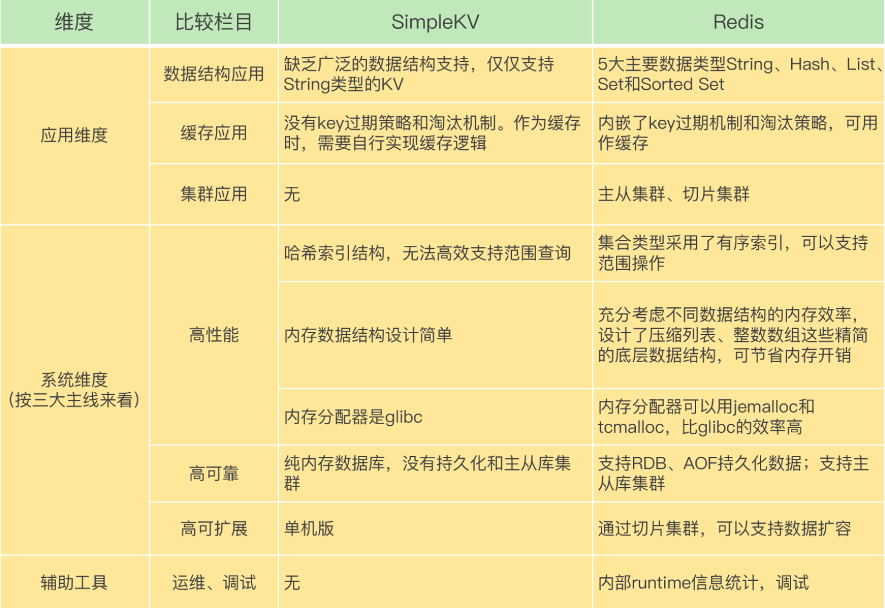
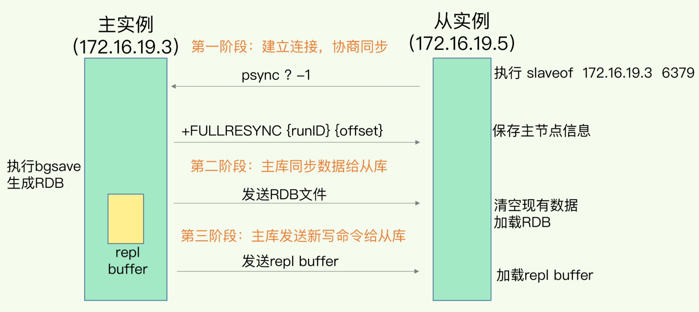
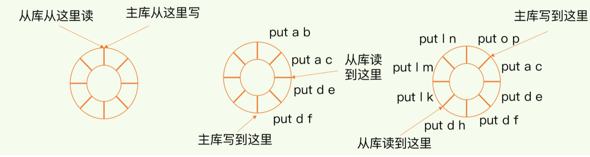
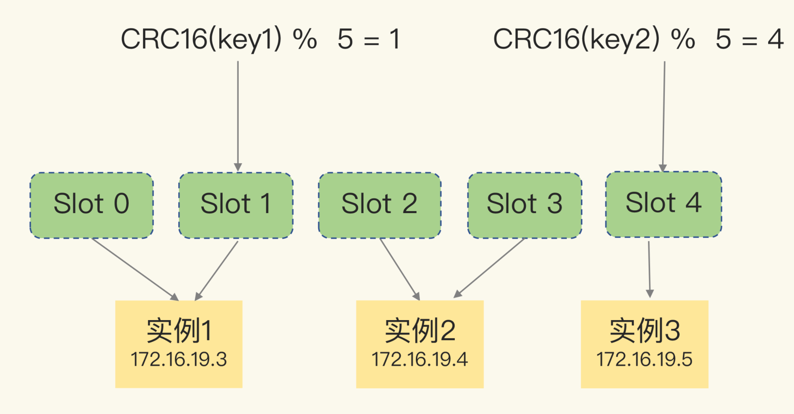
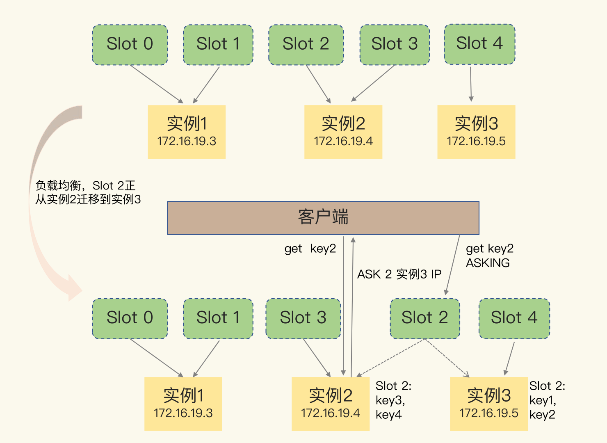

## redis内部架构


## 数据结构


## 渐进式rehash


## 集合类型的底层数据结构

主要有5种：整数数组、双向链表、哈希表、压缩列表和跳表

压缩列表实际上类似于一个数组，数组中的每一个元素都对应保存一个数据。和数组不同的是，压缩列表在表头有三个字段zlbytes、zltail和zllen，分别表示列表长度、列表尾的偏移量和列表中的entry个数；压缩列表在表尾还有一个zlend，表示列表结束。

在压缩列表中，如果我们要查找定位第一个元素和最后一个元素，可以通过表头三个字段的长度直接定位，复杂度是O(1)。而查找其他元素时，就没有这么高效了，只能逐个查找，此时的复杂度就是O(N)了


### 跳表


# 高性能IO模型：为什么单线程Redis能那么快？

Redis是单线程，主要是指**Redis的网络IO和键值对读写是由一个线程来完成的**

**线程编程模式面临的共享资源的 并发访问控制 问题**。

Redis的大部分操作在内存


Redis采用了**多路复用机制**

指一个线程处理多个IO流，就是我们经常听到的select/epoll机制。简单来说，在Redis只运行单线程的情况下，**该机制允许内核中，同时存在多个监听套接字和已连接套接字**


## 高可用性

一是**数据尽量少丢失**，二是**服务尽量少中断**

### Redis如何避免数据丢失？

**AOF** (Append Only File): 它是写后日志而AOF里记录的是Redis收到的每一条命令

写回策略

**AOF重写机制**

**RDB** (Redis Database):

```
redo log（重做日志），记录的是修改后的数据， 
```

**内存快照**。所谓内存快照，就是指内存中的数据在某一个时刻的状态记录

写时复制技术（Copy-On-Write, COW）


### Redis数据同步：主从库如何实现数据一致？

读写分离


为什么要采用读写分离的方式呢？

如果我们非要保持这个数据在三个实例上一致，就要涉及到加锁、实例间协商是否完成修改等一系列操作，但这会带来巨额的开销




psync命令包含了**主库的runID**和**复制进度offset**两个参数。

- runID，是每个Redis实例启动时都会自动生成的一个随机ID，用来唯一标记这个实例。当从库和主库第一次复制时，因为不知道主库的runID，所以将runID设为“？”。
- offset，此时设为-1，表示第一次复制。


**基于长连接的命令传播**

#### 主从库间网络断了怎么办？

当主从库断连后，主库会把断连期间收到的写操作命令，写入replication buffer，同时也会把这些操作命令也写入repl_backlog_buffer这个缓冲区。

repl_backlog_buffer是一个环形缓冲区，**主库会记录自己写到的位置，从库则会记录自己已经读到的位置**。



Redis的主从库同步的基本原理，总结来说，有三种模式：全量复制、基于长连接的命令传播，以及增量复制。

全量复制虽然耗时，但是对于从库来说，如果是第一次同步，全量复制是无法避免的，所以，我给你一个小建议：**一个Redis实例的数据库不要太大**，一个实例大小在几GB级别比较合适，这样可以减少RDB文件生成、传输和重新加载的开销

### 哨兵机制：主库挂了，如何不间断服务？


涉及到三个问题：

1. 主库真的挂了吗？

2. 该选择哪个从库作为主库？

3. 怎么把新主库的相关信息通知给从库和客户端呢？

    哨兵其实就是一个运行在特殊模式下的Redis进程

哨兵主要负责的就是三个任务：监控、选主（选择主库）和通知。

#### 主观下线和客观下线

**哨兵进程会使用PING命令检测它自己和主、从库的网络连接情况，用来判断实例的状态**

**通常会采用多实例组成的集群模式进行部署，这也被称为哨兵集群**。引入多个哨兵实例一起来判断，就可以避免单个哨兵因为自身网络状况不好，而误判主库下线的情况。


以分别按照三个规则依次进行三轮打分，这三个规则分别是**从库优先级、从库复制进度以及从库ID号**。只要在某一轮中，有从库得分最高，那么它就是主库了，选主过程到此结束。如果没有出现得分最高的从库，那么就继续进行下一轮。

slave-priority配置项，给不同的从库设置不同优先级


每个实例都会有一个ID，这个ID就类似于这里的从库的编号。目前，Redis在选主库时，有一个默认的规定：**在优先级和复制进度都相同的情况下，ID号最小的从库得分最高，会被选为新主库**。

### 哨兵集群：哨兵挂了，主从库还能切换吗？

#### 基于pub/sub机制的哨兵集群组成

哨兵实例之间可以相互发现，要归功于Redis提供的pub/sub机制，也就是发布/订阅机制

哨兵只要和主库建立起了连接，就可以在主库上发布消息了，比如说发布它自己的连接信息（IP和端口）。同时，它也可以从主库上订阅消息，获得其他哨兵发布的连接信息。当多个哨兵实例都在主库上做了发布和订阅操作后，它们之间就能知道彼此的IP地址和端口。


**哨兵是如何知道从库的IP地址和端口的呢？**


如何在客户端通过监控了解哨兵进行主从切换的过程呢？比如说，主从切换进行到哪一步了？这其实就是要求，客户端能够获取到哨兵集群在监控、选主、切换这个过程中发生的各种事件。

## 基于pub/sub机制的客户端事件通知

每个哨兵实例也提供pub/sub机制，客户端可以从哨兵订阅消息


举个例子，你可以执行如下命令，来订阅“所有实例进入客观下线状态的事件”：

```
SUBSCRIBE +odown
```

当哨兵把新主库选择出来后，客户端就会看到下面的switch-master事件。这个事件表示主库已经切换了，新主库的IP地址和端口信息已经有了。这个时候，客户端就可以用这里面的新主库地址和端口进行通信了。

```
switch-master <master name> <oldip> <oldport> <newip> <newport>
```

## 由哪个哨兵执行主从切换？

任何一个实例只要自身判断主库“主观下线”后，就会给其他实例发送is-master-down-by-addr命令。接着，其他实例会根据自己和主库的连接情况，做出Y或N的响应，Y相当于赞成票，N相当于反对票。


何一个想成为Leader的哨兵，要满足两个条件：第一，拿到半数以上的赞成票；第二，拿到的票数同时还需要大于等于哨兵配置文件中的quorum值。以3个哨兵为例，假设此时的quorum设置为2，那么，任何一个想成为Leader的哨兵只要拿到2张赞成票，就可以了


## 切片集群：数据增多了，是该加内存还是加实例？

切片集群，也叫分片集群，就是指启动多个Redis实例组成一个集群，然后按照一定的规则，把收到的数据划分成多份，每一份用一个实例来保存


## 如何保存更多数据？

纵向扩展（scale up）和横向扩展（scale out）。

- **纵向扩展**：升级单个Redis实例的资源配置，包括增加内存容量、增加磁盘容量、使用更高配置的CPU。就像下图中，原来的实例内存是8GB，硬盘是50GB，纵向扩展后，内存增加到24GB，磁盘增加到150GB。
- **横向扩展**：横向增加当前Redis实例的个数，就像下图中，原来使用1个8GB内存、50GB磁盘的实例，现在使用三个相同配置的实例。

想把切片集群用起来，我们就需要解决两大问题：

- 数据切片后，在多个实例之间如何分布？
- 客户端怎么确定想要访问的数据在哪个实例上？

切片集群是一种保存大量数据的通用机制，这个机制可以有不同的实现方案。在Redis 3.0之前，官方并没有针对切片集群提供具体的方案。从3.0开始，官方提供了一个名为Redis Cluster的方案

Redis Cluster方案采用哈希槽（Hash Slot，接下来我会直接称之为Slot），来处理数据和实例之间的映射关系。在Redis Cluster方案中，一个切片集群共有16384个哈希槽



手动分配哈希槽：实例1保存哈希槽0和1，实例2保存哈希槽2和3，实例3保存哈希槽4

```
redis-cli -h 172.16.19.3 –p 6379 cluster addslots 0,1 
redis-cli -h 172.16.19.4 –p 6379 cluster addslots 2,3 
redis-cli -h 172.16.19.5 –p 6379 cluster addslots 4
```

**在手动分配哈希槽时，需要把16384个槽都分配完，否则Redis集群无法正常工作**。

## 客户端如何定位数据？

哈希槽分布在哪个实例上

实例就会把哈希槽的分配信息发给客户端

实例之间还可以通过相互传递消息，获得最新的哈希槽分配信息，但是，客户端是无法主动感知这些变化的。这就会导致，它缓存的分配信息和最新的分配信息就不一致了

Redis Cluster方案提供了一种**重定向机制，**

客户端给一个实例发送数据读写操作时，这个实例上并没有相应的数据，客户端要再给一个新实例发送操作命令。

```
GET hello:key (error) MOVED 13320 172.16.19.5:6379
```


```
GET hello:key (error) ASK 13320 172.16.19.5:6379
```



从操作系统的角度来看，进程一般是指资源分配单元，例如一个进程拥有自己的堆、栈、虚存空间（页表）、文件描述符等；而线程一般是指CPU进行调度和执行的实体。

 


