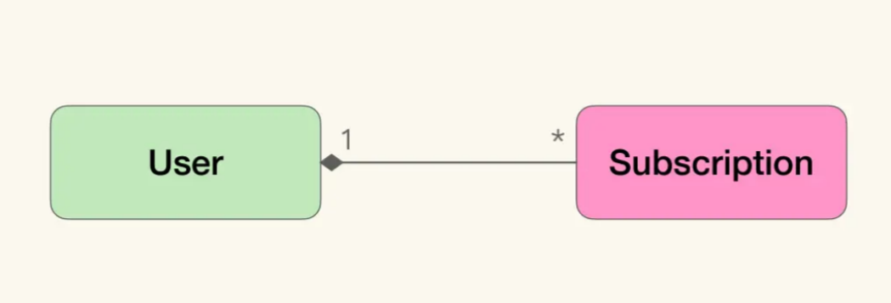
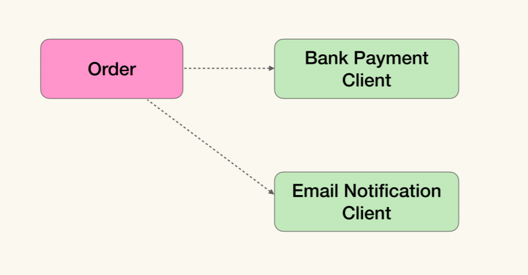
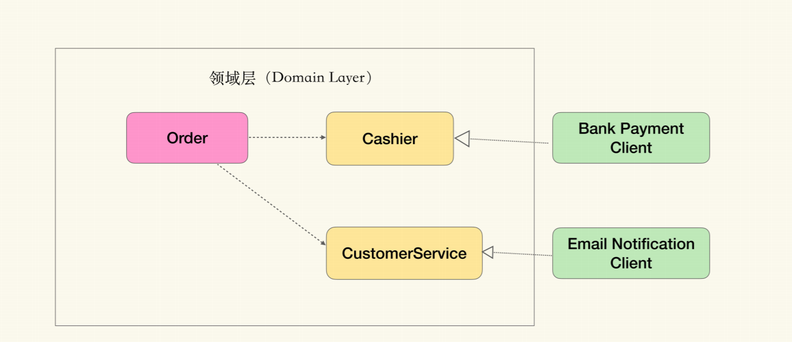

# 业务建模

遇到的问题

业务同事让我们开发一个功能：常常会说不就做个小小的修改吗 怎么过了这么久还没完成

而技术方也会抱怨怎么又改需求了，业务的流程是不是设计的不合理啊，

双方互看不爽

领域驱动设计提供了一种的方法，让业务方和技术方能沟通和协作

这个东西有什么用？这好像是业务同学关心的事情，我是一个开发，需要了解他吗？建模不建模，代码写出来有什么不一样吗？

这些问题说明我：希望从解决实际问题的角度出发， 看看领域驱动设计能帮我们做什么。


#### 领域驱动设计是什么？

领域驱动设计（Domain Driven Design，即 DDD）

#####    业务建模

是为了明确业务中的关键问题，使用易于实现的模型将业务问题表达出来的过程

我们都知道，软件开发的核心难度在于处理隐藏在业务知识中的复杂度，而模型就是对这种复杂度的简化与精炼 

通过模型简化问题，然后在技术中寻找对应的解决方案。可以把复杂度降低几个数量级

e.g. 

被都视为编程基本功的数据结构，其实也是一 系列的模型。

假设有这样一个需求：去火锅店吃饭 ，店家要求按照预约的先后顺序进店 ，使用链表这种数据结构能帮忙解决先进先出的问题。

类似的堆、栈、树、图等这些模型，帮我们解决了从编译器、内存管理到数据库索引等大量的基础问题(InnoDB)

程序 = 数据结构+ 算法，这是一 种模型驱动的思路，是从数据结构出发构造模型以描述问题，再通过算法解决问题。

数据结构是与具体领域无关的模型。业务方不能理解这些数据结构代表着什么逻辑 会有什么行为。

而领域驱动则是在讲：对于业务软件而言，从业务出发去构造与业务强相关的模型，是一种更好的选择。

**领域驱动设计：**通过领域模型（Domain Model）捕捉领域知识，使用领域模型构造更易维护的软件。

Eric Evans 在千禧年后发布他 的名著“Domain Driven Design：Tackling the Complexity in the Heart of Software”，

领域驱动设计这一理念迅速被行业采纳，时至今日仍是绝大多数人进行业务建模的首要方法。

作为一种建模方法，它在如何引领需求发掘，建立沟通反馈，如何与业务方共建模型等问题上，提供了一套出色的框架


#### 领域驱动设计怎么做？

Eric Evans 提倡了一种叫做知识消化 （Knowledge Crunching）的方法帮助我们去提炼领域模型。

知识消化五个步骤

- 关联模型与软件实现； 
- 基于模型提取统一语言； 
- 开发富含知识的模型； 
- 精炼模型； 
- 头脑风暴与试验。


##### 模型与软件实现关联

关联模型与软件实现。它将模型与代码统一在一起，使得对模型的修改，就等同于对代码的修改。

Hibernate（一种 Object Relationship Mapping 框架，可以将对象模型与其存储模型映射，从而以对象的角度去操作存储）



​                                                                                      1：N

------


```java
class UserDAO {
    ...
    public User find(long id) {
        try (PreparedStatement query = connection.createStatement(...)){
            ResultSet rs = query.executeQuery(....);
            if (rs.next)
                return new User(rs.getLong(1), rs.getString(2), ....);
            ....
        } catch(SQLException e){
        		...
        }
    }
}

class TradeDAO {
    ...
    // 根据用户Id寻找其做的交易
    public List<Trade> findTradeByUserId(long userId) {
    		...
    }
    // 根据用户Id，计算其所交易的总数量
    public double calculateTotalTradeNum(long userId) {
    		...
    }
}
```

“贫血对象模型”（Anemic Model）的实现风格，即：对象仅仅对简单的数据进行封装，而关联关系和业务计算都散落在对象的范围之内。这种方式实际上是在沿用过程式的风格组织逻辑，而没有发挥面向对象技术的优势


“充血模型”，与某个概念相关的主要行为与逻辑，都被封装到了对应的领域对象中。---“富含知识的模型"

构造“富含知识的模型”的一些关键元素：实体（Entity）与值对象 （Value Object）对照、通过聚合（Aggregation）关系管理生命周期等等


```java
class User {
    // 获取用户做过的所有交易
    public List<Trade> getTrade() {
        ...
    }
    // 计算其所做交易的总数量
    public double getTotalTradeNum() {
        ...
    }
}
class UserRepository {
    ...
    public User findById(long id) {
        ...
    }
}
```

User是聚合根（Aggregation Root）； Trade是无法独立于用户存在的，而是被聚合到User对象中。

从外部访问只能通过聚合根访问Trade, 只有聚合根才能直接使用database查询

```
 实体 :  唯一标识   
 值对象 : 没有标识符描述的对象(属性)
 工厂(factories)： 用来封装创建一个复杂对象尤其是聚合时所需的知识，为了将创建对象的细节隐藏起
 仓储（repositories）：仓储是用来管理实体的集合
 dao是面向数据访问的，更接近数据库，而repository更接近领域与dao进行交互
 服务（services）：只负责协调并委派业务逻辑给领域对象进行处理，其本身并真正实现业务逻辑，绝大部分的业务逻辑都由领域对象承载和实现
```


##### 基于模型提取统一语言（Ubiquitous Language）

将业务方变成模型的使用者。那么通过统一语言进行需求讨论，实际就是通过模型对需求进行讨论

whatif     sceanrio

##### 提炼知识的循环

  后面三步构成了一个提炼知识的循环：通过统一语言讨论需求；发现模型中的缺失或者不恰当的概念，精炼模型以反映业务的实践情况；对模型的修改引发了统一语言的改变，再以试验和头脑风暴的态度，使用新的语言以验证模型的准确。 如此循环往复，不断完善模型与统一语言

总结为“两关联 一循环“


模型与软件实现关联如何实现？




```
public class Order {
public void pay() {
BankResponse response = bank.pay(....);
if （response.isOk()) {
payments.add(new Payment(response...));
status = ....;
email.send(....);
} else {
email.send(....);
}
}
}
```

从领域驱动设计角度来看并不算好。因为我们在领域层中，直接依 赖了基础设施层中的网银网关客户端和邮件通知客户端。但是想改正这个问题，并没有那 么容易。 因为领域层被认为定义为绝对稳定，它不能依赖任何非领域逻辑（除了基础库）。而我们 又要使用网银客户端和邮件通知客户端来完成功能，那该怎么办呢？我们只好将网银客户 端和邮件通知客户端移动到领域层内。 但是我们不能直接移动，毕竟领域层中只能是领域概念与逻辑，与具体业务无关的概念是 不能进去领域层的。于是我们需要 ** 将对基础设施层的依赖，看作一种未被发现的领域概 念进行提取，这样其实就发挥了我们定义业务的权利，从业务上去思考技术组件的含义。 一种有效的方法是将技术组件进行拟人化处理




//领域层内 interface Cashier { ... } interface CustomerService { ... } public class Order { public void pay(Cashier cashier, CustomerService staff) { try { Payment payment = cashier.collect(...); payments.add(payment); staff.tell(owner, ..); } catch(....) { staff.tell(owner, ..); } } }

//领域层外 public class BankPaymentCahsier extends BankPaymentClient implements Cashier {

public class EmailCustomerService extends EmailNotificationClient implements C

你肯定觉得，就这？这不就是抽个接口改个名吗？是的，从实现技法上看，这是简单得不 能再简单的面向对象方式了：从具体实现方法中寻找到一个抽象接口，然后将从对具体实 现的依赖，转化为对接口的依赖（SOLID 中的里氏替换原则）。

\1. 领域模型与软件实现关联； 2. 统一语言与模型关联。

#### 领域驱动设计的好处？

在业务系统中构造领域模型，将相关的业务流程与功能转化成模型的行为，能避免开发人员与业务方的认知差异

1.  通过模型反映软件实现（Implementation）的结构； 

2.  以模型为基础形成团队的统一语言；

    3.把模型作为精粹的知识，以用于传递。

1.理解了模型，你就会大致理解代码的结构；

2 在讨论需求的时候，研发人员可以很容易明白需要改动的代码，并对风险与进度有更好的评估； 

3.模型比代码更简洁，毕竟模型是抽象出来的，因而有更低的传递成本


